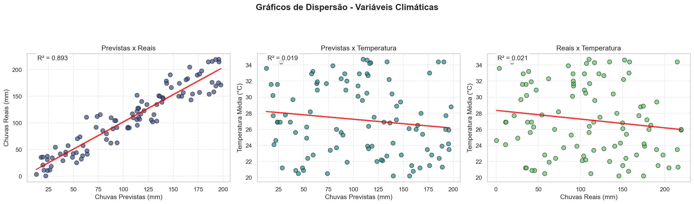
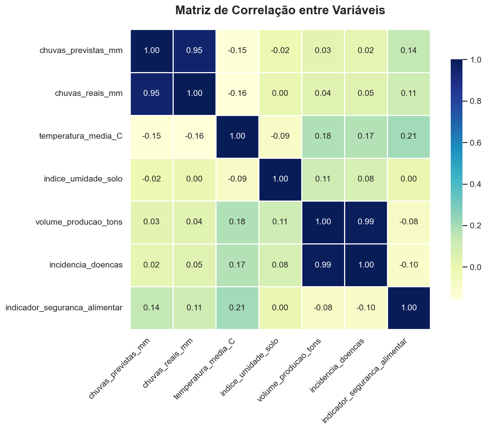
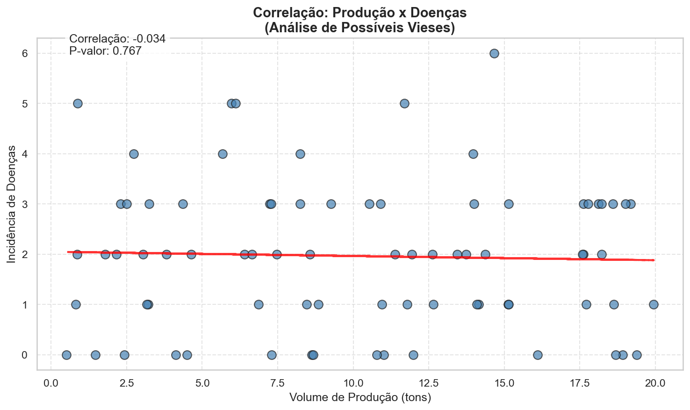

# 🌳 Análise Integrada de Clima, Recursos Hídricos e Produtividade na Amazônia

## ✨ Visão Geral
Este projeto explora dados climáticos e socioeconômicos de comunidades amazônicas, buscando compreender como fatores ambientais influenciam a produção agrícola e a qualidade de vida local. A análise visa apoiar decisões para uma gestão sustentável e resiliente na região.

**🚀 Versão Melhorada:** Implementação de técnicas avançadas de limpeza de dados, análise de correlações robustas e visualizações aprimoradas para garantir resultados confiáveis.

---

## 🎯 Objetivos
- Investigar a relação entre chuvas, temperatura, umidade do solo e indicadores socioeconômicos
- Identificar padrões que possam orientar políticas públicas e ações comunitárias
- Gerar visualizações claras para facilitar a interpretação dos dados
- **NOVO:** Detectar e corrigir vieses nos dados (outliers, duplicatas, correlações artificiais)
- **NOVO:** Fornecer análises estatísticas robustas com múltiplos métodos de correlação

---

## 📦 Fontes de Dados
- **Climáticos:** Precipitação (prevista e real), temperatura média, umidade do solo, eventos extremos
- **Socioeconômicos:** Volume de produção agrícola, incidência de doenças, acesso à água potável, segurança alimentar
  
**Período:** Janeiro a Abril de 2025 (122 registros diários)

---

## 🛠️ Funcionalidades Implementadas

### **🔧 Limpeza e Qualidade dos Dados**
- **Detecção e remoção de duplicatas** - Identificação automática de registros duplicados
- **Tratamento de outliers extremos** - Filtros para valores impossíveis (ex: chuvas > 300mm/dia, produção > 100 tons)
- **Padronização categórica** - Uniformização de termos ("sim"/"não", "nao"/"não")
- **Preenchimento inteligente** - Forward fill para manter continuidade temporal
- **Verificação de valores negativos** - Remoção de dados impossíveis (chuvas negativas)

### **📊 Análise Exploratória Avançada**
- **Estatísticas descritivas** - Média, mediana, desvio padrão, quartis para todas as variáveis
- **Verificação sistemática de qualidade** - Relatório detalhado de duplicatas e outliers
- **Análise de correlações robustas** - Pearson e Spearman para detectar influência de outliers
- **Normalização de dados** - Z-score para evitar distorções por escalas diferentes
- **Testes de significância estatística** - P-valores para validar correlações

### **📈 Visualizações Melhoradas**
- **Gráficos de dispersão com linhas de tendência** - Incluindo coeficientes R² e equações
- **Heatmap com correlações destacadas** - Cores contrastantes para correlações > 0.8
- **Análise específica produção x doenças** - Gráfico dedicado com estatísticas detalhadas
- **Rótulos informativos** - Unidades de medida e títulos explicativos
- **Paleta de cores divergente** - Melhor contraste e interpretação

---

## 📊 Exemplos de Visualizações

|  |  |
|:-------------------------------------:|:-------------------------------:|
| **Dispersão climática com tendências** - Inclui linhas de regressão e R² | **Matriz de correlação destacada** - Correlações > 0.8 em evidência |

|  |
|:-----------------------------------------------------------:|
| **Análise específica: Produção x Doenças** - Com estatísticas e p-valores |

---

## 🔍 Estrutura do Projeto

```
amazonia-integrada-dados/
├── main.py                 # Script principal
├── requirements.txt        # Dependências
├── README.md              # Documentação
├── data/                  # Bases de dados
│   ├── base_climatica.csv
│   └── base_socioeconomica.csv
├── src/                   # Módulos de análise
│   ├── limpeza_dados.py
│   ├── analise_exploratoria.py
│   └── visualizacoes.py
└── graficos/              # Visualizações geradas
    ├── disp_clima.png
    ├── heatmap.png
    └── corr_producao_doencas.png
```
---
## 🚀 Como Utilizar

### **1. Clone o repositório:**
```bash
git clone https://github.com/seu-usuario/amazonia-integrada-dados.git
cd amazonia-integrada-dados
```

### **2. Crie um ambiente virtual (recomendado):**
```bash
python -m venv venv
# Ative conforme seu sistema operacional
# Linux/Mac: source venv/bin/activate
# Windows:   venv\Scripts\activate
```

### **3. Instale as dependências:**
```bash
pip install -r requirements.txt
```

### **4. Execute a análise completa:**
```bash
python main.py
```

### **5. Confira os resultados:**
- **Relatório no terminal** - Análise de qualidade e correlações
- **Gráficos na pasta `graficos/`** - Visualizações melhoradas
- **Estatísticas detalhadas** - Resumo dos dados limpos

---

---

## 💡 Requisitos
- **Python 3.8** ou superior
- **Bibliotecas principais:**
  - `pandas` - Manipulação de dados
  - `numpy` - Computação numérica
  - `matplotlib` - Visualizações básicas
  - `seaborn` - Visualizações estatísticas
  - `scipy` - Estatísticas avançadas

---


---

## 🎯 Insights Esperados

O projeto visa identificar:
- **Padrões climáticos** que afetam a produção agrícola
- **Relações significativas** entre variáveis ambientais e socioeconômicas
- **Pontos críticos** para intervenção e políticas públicas
- **Tendências temporais** nos dados amazônicos
- **Vieses nos dados** que podem distorcer análises

---

## 👥 Créditos
Desenvolvido para a disciplina de Introdução à Análise de Dados II (I2A2 Academy).

- **Autor:** [Adriana Lima] - [Curso IA Aplicada, I2A2 Academy]
- **Data:** 2025

---
