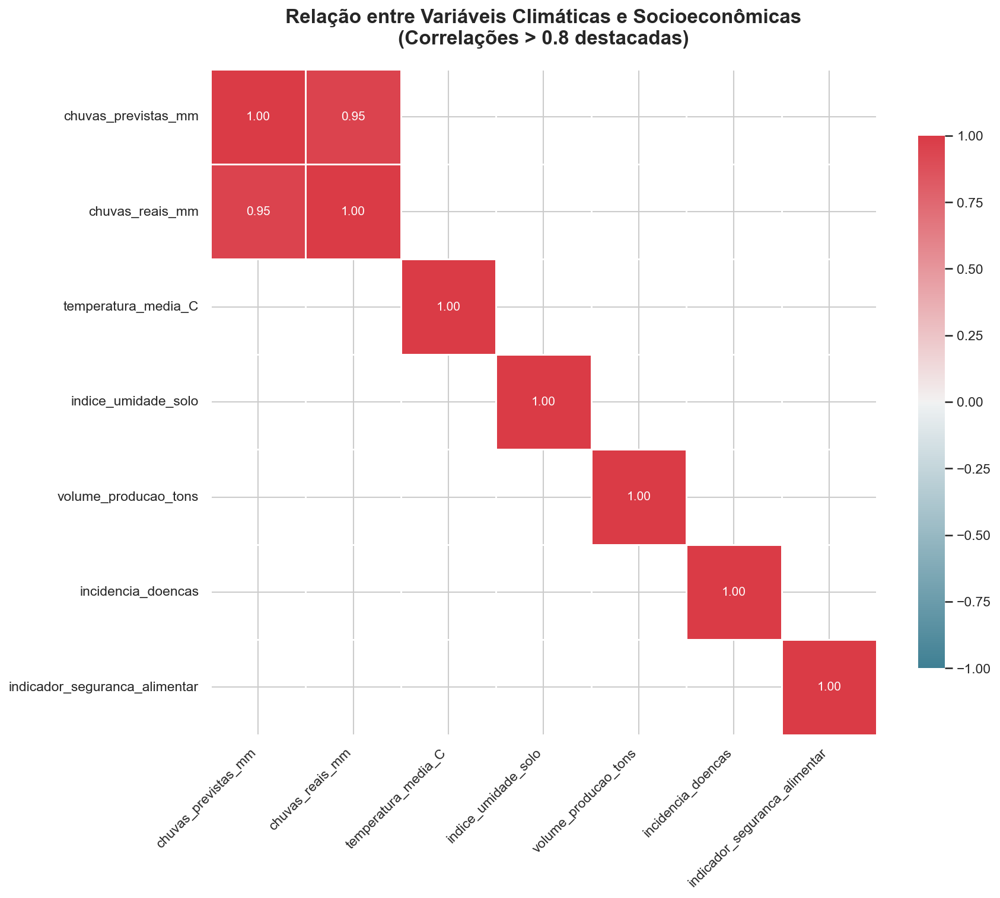

# 🌳 Análise Integrada de Clima, Recursos Hídricos e Produtividade na Amazônia

## ✨ Visão Geral
Este projeto explora dados climáticos e socioeconômicos de comunidades amazônicas, buscando compreender como fatores ambientais influenciam a produção agrícola e a qualidade de vida local. A análise visa apoiar decisões para uma gestão sustentável e resiliente na região.

---

## 🎯 Objetivos
- Investigar a relação entre chuvas, temperatura, umidade do solo e indicadores socioeconômicos.
- Identificar padrões que possam orientar políticas públicas e ações comunitárias.
- Gerar visualizações claras para facilitar a interpretação dos dados.

---

## 📦 Fontes de Dados
- **Climáticos:** Precipitação, temperatura média, umidade do solo, eventos extremos.
- **Socioeconômicos:** Volume de produção agrícola, incidência de doenças, acesso à água potável, segurança alimentar.

Os arquivos estão disponíveis na pasta `data/`.

---

## 🛠️ Funcionalidades
- **Limpeza e Padronização:**
  - Remoção de duplicatas e tratamento de valores extremos (ex: chuvas > 300 mm/dia).
  - Uniformização de categorias textuais ("sim"/"não").
  - Preenchimento inteligente de dados ausentes.
- **Análise Exploratória:**
  - Estatísticas descritivas para cada base.
  - Cálculo de correlações entre variáveis ambientais e socioeconômicas.
- **Visualização:**
  - Gráficos de dispersão organizados para relações-chave.
  - Heatmap de correlação para visão global dos dados.

---

## 📊 Exemplos de Visualizações
|  |  |
|:-------------------------------------:|:-------------------------------:|
| Dispersão entre variáveis climáticas  | Matriz de correlação            |

---

## 🚀 Como Utilizar
1. **Clone o repositório:**
   ```bash
   git clone https://github.com/seu-usuario/tarefa3_i2a2.git
   cd tarefa3_i2a2
   ```
2. **(Opcional) Crie um ambiente virtual:**
   ```bash
   python -m venv venv
   # Ative conforme seu sistema operacional
   # Linux/Mac: source venv/bin/activate
   # Windows:   venv\Scripts\activate
   ```
3. **Instale as dependências:**
   ```bash
   pip install -r requirements.txt
   ```
4. **Execute a análise:**
   ```bash
   python main.py
   ```
5. **Confira os gráficos na pasta `graficos/`.**

---

## 💡 Requisitos
- Python 3.8 ou superior
- Bibliotecas: pandas, numpy, matplotlib, seaborn

---

## 👥 Créditos
Desenvolvido para a disciplina de Introdução à Análise de Dados II (I2A2 Academy).

- Autor: [Seu Nome](https://github.com/seu-usuario)

---

## 📄 Licença
Distribuído sob a licença MIT. Sinta-se à vontade para usar e contribuir!
